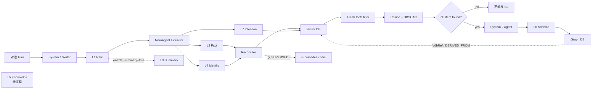

# Evolution Hub 架构图审计

> 审计日期：2026-07-08
> 审计对象：`dashboard/dist/architecture.json`、`evolution_hub/architecture.svg` 及历史仓库快照中的 HY Memory 1.2.19 定制源码；`hy-memory/` 源码目录已从本仓库移除。

## 1. 总体判断

架构图对 Hermes 主执行链的描述大体成立，但 HY Memory 区域混合了三种状态：

1. 当前源码真实执行路径；
2. 默认关闭或仅特定模式启用的可选能力；
3. 尚未实现的设计层。

因此，这张图适合作为“概念全景图”，不适合作为“当前运行时事实图”。最严重的问题集中在 L3、L5、L6/L7 的生产者与存储位置，以及把记忆层画成串行加工链。

## 2. 需要修正的问题

### P0：L5_KNOWLEDGE 被画成已实现产出

图中：

- `L5_KNOWLEDGE` 描述为 MemAgent 从 L1_RAW 提炼领域知识。
- `System 1 Writer` 描述明确列出 L5_KNOWLEDGE。
- 连线把 `L4_IDENTITY -> L5_KNOWLEDGE -> Reconciler` 作为正常主路径。

源码事实：

- `hy-memory/package/hy_memory/models/memory.py:33` 明确写着 L5 Knowledge Graph “暂未实现”。
- `hy-memory/package/hy_memory/pipelines/writer.py:425` 的 reconcile 层过滤只有 L2_FACT 与 L4_IDENTITY。
- reader 的多条路径也显式排除 L5_KNOWLEDGE。

影响：读者会认为广告、投资等领域知识已被单独组织并进入稳定检索，实际上它们主要仍以 L2 事实或 L6 Schema 形式存在。

建议：将 L5 标记为 `占位 / 未实现`，使用虚线边框，不连接到当前主写入链。

### P0：L2 -> L3 -> L4 -> L5 的串行链错误

`architecture.json` 当前连接：

```text
MemAgent -> L2_FACT -> L3_SUMMARY -> L4_IDENTITY -> L5_KNOWLEDGE -> Reconciler
```

这暗示每一层由上一层加工而来。实际 writer 中这些是独立输出类型：L2/L4 进入 reconcile，L3 由 Summarizer 可选生成，L5 未实现。它们不是固定的串行流水线。

建议改为：

```text
L1_RAW -> MemAgent
MemAgent -> L2_FACT -> Reconciler
MemAgent -> L4_IDENTITY -> Reconciler
L1_RAW -> L3_SUMMARY  [可选、默认关闭]
L5_KNOWLEDGE          [占位、未接线]
```

### P0：L6_SCHEMA 的存储位置写错，L7_INTENTION 的生产者也写错

图中 `L6_SCHEMA` 描述称“写入 Vector DB”，并把 L7 描述为 System 2 Writer 的产物后连接 Graph DB。

源码事实：

- `hy-memory/package/hy_memory/pipelines/system2_writer.py:5-10` 明确说明：L7 意图由 S1/pro 提取，S2 负责归纳 L6 Schema，且 S2 Agent 是 Graph 的唯一写入者。
- `system2_tools.py:123` 的通用工具允许创建 L6 或 L7 Graph 节点，`:435` 通过 `graph_store.upsert_memory_node()` 写入；但当前标准 S2 流程的目标是 L6。
- `hy-memory/package/hy_memory/pipelines/writer.py:339-400` 是当前 L7 主写入路径，`:392` 实际调用 `vector_store.upsert(node)`。
- `models/memory.py:35-37` 又将 L7 声明为 Graph 层，因此当前源码自身存在“层定义与运行写入路由不一致”。
- Vector DB 还为 L6 Graph 节点提供 evidence VdbRef，但不是 L6 的主存储位置。

建议按当前实际运行路径绘制：

```text
S1/MemAgent -> L7_INTENTION -> Vector DB
S2 Agent -> L6_SCHEMA -> Graph DB
Graph DB -. VdbRef/DERIVED_FROM .-> Vector DB evidence
```

同时在图注中标记 L7 的“设计层归属为 Graph、当前主写入仍为 VDB”这一技术债，直到代码统一后再调整图。

### P1：L3_SUMMARY 没有标注默认关闭

图中 L3 是正常实线节点。

源码事实：

- `hy-memory/package/hy_memory/config.py:156` 注释说明默认关闭。
- `config.py:196-199` 将未显式设置的 `enable_summary` 置为 `False`。
- System 2 是否纳入 L3 还有独立的 `MEMORY_SUMMARY_ENABLED_IN_SYS2` 开关。

建议：L3 使用虚线，并标注“可选；写入默认关闭；S2 消费另有开关”。

### P1：System 2 缺少真正的触发门

图中 `Vector DB -> System 2 Writer` 容易让人理解为所有事实都会进入慢思考。

源码事实：

- `hy-memory/package/hy_memory/pipelines/system2_agent.py:6-14` 的真实入口是：取未处理事实，DBSCAN 聚类，只有形成 cluster 才调用 Agent。
- `system2_agent.py:336-349` 会排除已经被 Schema 引用的事实。
- `system2_agent.py:382-409` 使用余弦距离和两阶段 DBSCAN。

建议在 Vector DB 与 System 2 之间增加：

```text
Fresh Facts Filter -> Embedding/Cosine -> DBSCAN -> clusters_found?
```

无 cluster 的分支应明确标记为“不触发 S2”。这也是该系统偏向语义网络而非因果时序的关键结构证据。

### P1：演化链没有画出真实触发条件

当前图展示 Reconciler，却没有说明 `supersedes` 只在矛盾/状态替代时形成。

源码事实：

- `hy-memory/package/hy_memory/agent/reconciler.py:70-83`：`SUPERSEDE` 进入演化链；`UPDATE` 合并精炼但不进入链。
- `_trace_full_chain` 只能回溯已经存在的 `supersedes/superseded_by`，不会主动发现经历、推导与修正之间的因果关系。

建议在 Reconciler 后拆为：

```text
ADD -> 独立事实
UPDATE -> 新节点 + 旧节点 SHADOW，不连演化链
SUPERSEDE -> supersedes/superseded_by 演化链
```

不要用普通的 A->B->C 图示暗示系统已经记录完整认知演化史。

### P1：四类 Schema 边容易被误解成原生因果抽取

定制版已经支持 `RELATED_TO/CORRECTED/SHAPED_BY/BUILDS_ON`，但这些边是在语义聚类后由 S2 LLM 对 Schema 进行补充，不是从原始事件流中确定性抽取的因果链。

建议在图例中区分：

- `supersedes`：L2 状态替代链；
- `CORRECTED`：Schema 修正关系；
- `SHAPED_BY/BUILDS_ON`：LLM 推断的 Schema 关系；
- `DERIVED_FROM`：Schema 到 VDB evidence 的来源关系。

### P2：静态 SVG 与 Dashboard 动态图不是同一版本

`evolution_hub/architecture.svg` 是较简化的固定图；Dashboard 实际使用 `dashboard/dist/architecture.json` 动态渲染更完整的结构。两者节点和语义并不完全一致。

建议：

- 明确一个单一真相源；或
- 在 SVG 标题/元数据中注明版本和生成来源；或
- 从 `architecture.json` 自动生成 SVG，避免两份图长期漂移。

## 3. Hermes 主链评价

Hermes 主执行链整体比 HY Memory 区准确，以下节点与源码能够对应：

- Agent Init：`agent/agent_init.py`
- Turn Context：`agent/turn_context.py`
- 主循环：`agent/conversation_loop.py`
- 工具并发/串行：`agent/tool_executor.py`
- ContextEngine：`agent/context_engine.py`
- Turn Finalizer：`agent/turn_finalizer.py`
- 外部记忆：`agent/memory_manager.py` 与 `agent/memory_provider.py`

仍建议补充两个节点：

1. `Coding Context`：代码仓库中会自动注入编码姿态，但 `auto` 与 `focus` 行为不同。
2. `Verify on Stop`：代码修改后的停止守卫是可选能力，默认关闭。

另外，`api_mode=codex_app_server` 会绕过 Hermes 默认主循环，将整轮任务交给 Codex App Server。若架构图目标是覆盖所有运行模式，应增加一条从 Turn Context 到 Codex App Server 的旁路。

## 4. 推荐的 HY Memory 运行时图



## 5. 最终判断

当前架构图不是完全错误，但它把“层级命名”误画成“串行处理”，并把可选或未实现能力表现成稳定主路径。若继续以“运行架构图”对外展示，应优先修复三个 P0：

1. L5 标记为未实现；
2. 拆掉 L2->L3->L4->L5 串行链；
3. 将 L6 改为 Graph DB，并把 L7 改为 S1 产出、当前写入 Vector DB，同时标注源码内部的层归属冲突。

完成这三项后，再补充 DBSCAN 触发门和演化链条件，图才会准确表达当前系统，而不是官网式的目标架构。
