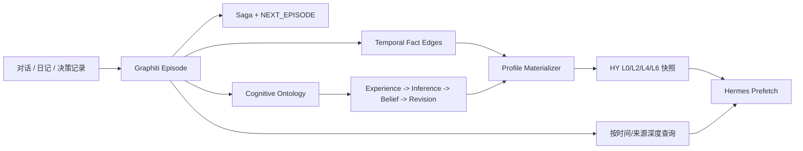

# Graphiti 与 HY Memory 源码对比

> 审计日期：2026-07-08
> Graphiti 基线：本地 `D:/CS/graphiti-main`，`pyproject.toml` 版本 `0.29.2`；该目录不含 `.git`，无法记录 commit。
> HY Memory 基线：本仓库保存的定制版 `1.2.19`，包含 `hy-memory/INDEX.md` 所列 P1-P13 patch。

## 1. 结论

Graphiti 与 HY Memory 解决的不是同一个核心问题：

- Graphiti 是动态、双时态的事实与事件图，核心问题是“什么事实在什么时候成立、什么时候失效、来自哪次经历”。
- HY Memory 是面向个人 Agent 的分层记忆与画像系统，核心问题是“用户现在是谁、有哪些事实、偏好和高层 Schema”。

针对“记录认知演化史”的需求，Graphiti 的底层模型明显更合适。它原生保留 Episode、事实来源、事实有效期、失效时间和 Episode 顺序；HY 的 `supersedes` 只在 reconcile 将新旧事实判定为矛盾或替代时生成，普通补充、推导和精炼不会自然组成演化链。

但 Graphiti 也不会自动理解“为什么用户改变了观点”。要得到真正的认知演化，仍需定义认知本体，例如 `Experience`、`Belief`、`Evidence`、`Inference`、`Decision` 和 `Revision`，以及 `LED_TO`、`SUPPORTED_BY`、`REVISED_TO`、`SHAPED_BY` 等边。

## 2. 快速对比

| 维度 | Graphiti 0.29.2 | 定制 HY Memory 1.2.19 |
|---|---|---|
| 基本单位 | Episode、Entity、Fact Edge、Community、Saga | L0-L7 MemoryNode |
| 原始来源保留 | 强，Episode 是一等节点 | L1 Raw 存在，但默认召回路径较弱 |
| 时间模型 | 强，`valid_at/invalid_at/expired_at/reference_time` | `memory_at/valid_until` + supersedes |
| 矛盾处理 | 旧事实失效但保留 | SUPERSEDE 建链；UPDATE 通常不建链 |
| 来源追踪 | Fact Edge 保存 episode IDs | L6 通过 DERIVED_FROM/VdbRef 关联证据 |
| 顺序建模 | Saga + NEXT_EPISODE | 主要依赖时间字段，没有通用 Episode 链 |
| 检索 | BM25、向量、BFS、RRF、MMR、Cross Encoder | 向量、BM25、层过滤、定制 Graph traverse |
| 用户画像 | 需自行建模 | L0/L2/L4/L6 开箱即用 |
| 高层 Schema | Community/摘要可辅助，但无个人认知 Schema 语义 | S2 DBSCAN + LLM 归纳 L6 Schema |
| 因果关系 | 可通过自定义 edge type 建模 | 定制边支持 SHAPED_BY/BUILDS_ON，但触发较弱 |
| 存储 | 图数据库为核心 | VDB + Graph DB + cache DB |
| 本地轻量性 | 较重 | 对 Hermes 更轻、更直接 |
| 工程成熟度 | 完整包、类型检查、迁移、多 Driver、409 个测试函数 | 功能丰富，但当前版本需要多项本地 patch |
| Hermes 集成 | 需要新 Provider/适配层 | 已经集成 |

## 3. Graphiti 数据模型

### 3.1 Episode 是一等来源

`D:/CS/graphiti-main/graphiti_core/nodes.py:318-332` 定义 `EpisodicNode`，保存原始内容、来源类型、来源描述、`valid_at` 和自定义 metadata。`graphiti.py:1098-1111` 在每次 `add_episode()` 时先创建或读取 Episode。

这与 HY 的关键差异是：Graphiti 的事实图始终锚定原始 Episode，而不是只把原始对话当作后续抽取的暂存材料。

### 3.2 Fact Edge 自带双时态与来源

`graphiti_core/edges.py:263-284` 的 `EntityEdge` 保存：

- `episodes`：支持该事实的 Episode ID；
- `valid_at`：事实开始成立的业务时间；
- `invalid_at`：事实停止成立的业务时间；
- `created_at/expired_at`：系统写入与失效处理时间；
- `reference_time`：产生该边的 Episode 参考时间。

这比 HY 的 `supersedes/superseded_by` 更适合查询：

```text
2024 年我相信什么？
这个观点什么时候失效？
哪段日记或对话支持这个结论？
```

### 3.3 Saga 与 Episode 顺序

`graphiti_core/graphiti.py:1035-1044` 允许 Episode 加入 Saga；`graphiti.py:750-770` 创建 `NEXT_EPISODE` 与 `HAS_EPISODE`，批量写入还会在 `:1423-1444` 按 `valid_at` 排序后建立链。

这能表示某个持续主题的事件序列，例如“买命论形成过程”或“声乐 App 创业阶段”。HY 当前没有对应的通用 Episode 顺序结构。

## 4. 写入与演化机制

### 4.1 Graphiti 写入

`graphiti_core/graphiti.py:980-1215` 的 `add_episode()` 主路径是：

```text
读取历史 Episode
-> 保存新 Episode
-> 抽取 Entity
-> Entity 去重
-> 抽取 Fact Edge 与时间
-> Edge 去重和矛盾检测
-> 失效旧 Edge
-> 更新 Entity 摘要
-> 保存 Episode/Entity/Edge/Saga
```

源码注释在 `:1052-1059` 明确要求 Episode 顺序写入，并建议放入后台队列。这说明它不是低成本热路径：一次写入可能触发多次抽取、embedding、搜索、去重和摘要调用。

### 4.2 Graphiti 的矛盾失效

`graphiti_core/utils/maintenance/edge_operations.py:325-535` 会为新边查找重复和潜在冲突边；`:538-570` 根据新旧事实的有效时间设置旧边 `invalid_at` 和 `expired_at`。

优点是旧事实仍保留，且“事实有效时间”与“系统发现时间”分离。它比 HY 只依赖 `SUPERSEDE` 操作更接近真正的历史状态模型。

限制是矛盾候选与最终判断仍依赖向量/BM25 检索及 LLM。错误抽取仍可能造成错误失效，不能视为确定性事实系统。

### 4.3 HY 的写入与演化

HY 的 L2/L4 先经过 Reconciler：

- `hy-memory/package/hy_memory/pipelines/writer.py:486-520` 区分 `SUPERSEDE` 和 `UPDATE`；
- `SUPERSEDE` 会将旧节点标记为 SUPERSEDED，并创建 `supersedes/superseded_by`；
- `UPDATE` 是同主题精炼，当前实现倾向原地更新，不进入演化链；
- `_retrieval/evolution.py:61-127` 只能回溯已经存在的链。

因此 HY 擅长“当前记忆去重和保持最新”，但不擅长记录每一步如何由经历和推导产生。

## 5. 检索能力

### 5.1 Graphiti

`graphiti_core/search/search_config_recipes.py:33-108` 提供组合检索：

- Edge、Node、Community：BM25 + cosine similarity；
- Episode：BM25；
- 可选 BFS 图扩展；
- RRF、MMR 或 Cross Encoder 重排。

`graphiti_core/search/search.py:98-243` 会并发执行 Edge、Node、Episode 与 Community 检索，并返回对应分数。检索配置可针对事实、实体、经历或社区分别定制。

### 5.2 HY

定制 HY 已经不是单纯向量搜索：

- `reader_legacy.py:304-369` 分离 VDB 与 L6 Graph 路；
- `reader_legacy.py:521-534` 沿 CORRECTED、SHAPED_BY、BUILDS_ON 展开；
- `reader_hybrid_v2.py:273-277` 可召回 SUPERSEDED 节点并展开演化链。

但它的高层 Schema 入口仍由 `system2_agent.py:361-409` 的 cosine + DBSCAN 决定。没有形成 cluster 的事实不会进入 S2，这使其天然偏向相似主题归纳。

判断：Graphiti 的检索组合、时间过滤和来源追踪更成熟；HY 的优势是能直接把 L0/L4/L6 作为用户画像上下文注入 Agent。

## 6. 高层抽象能力

### Graphiti

Graphiti 有 Entity 摘要、Community 和 Saga Summary，可以形成主题级压缩；也允许在 `graphiti.py:990-995` 传入 Pydantic `entity_types`、`edge_types`、`edge_type_map` 与自定义抽取指令。

但它默认没有“人格画像”“行为 Schema”“概念 Schema”的产品语义。若不定义本体，Graphiti 主要得到人物、对象和事实关系图，不会自动生成你当前 HY 中的第一性原理、分析优先等 L6 节点。

### HY Memory

HY 的 S2 直接面向个人模式归纳：`system2_agent.py:254-264` 区分 Behavioral Pattern 与 Concept Schema，并支持 CORRECTED、SHAPED_BY 和 BUILDS_ON。

优势是开箱即用地输出“当前用户模型”；不足是归纳前先按语义相似聚类，且边主要由 LLM 在 Schema 层后补，原始 Episode 到认知变化之间仍缺少结构化过程。

## 7. 工程成熟度与成本

Graphiti 本地快照包含：

- 157 个 `graphiti_core` Python 文件；
- 409 个测试函数；
- Ruff、Pyright、pytest 与集成测试配置；
- Neo4j、FalkorDB、Neptune Driver；Kuzu 已标记 deprecated；
- Server 与 MCP Server。

HY 当前仓库没有上游完整测试体系，且定制版维护 P1-P13 patch，包括关系类型、Graph traverse、JSON 截断和 Kuzu checkpoint 等修复。

因此 Graphiti 的核心工程基础更成熟，但部署更重、写入成本更高；HY 更适合单用户本地 Hermes，但版本升级和数据一致性风险更高。

## 8. 对认知演化需求的判断

### Graphiti 已经解决的部分

- 原始经历保留；
- 经历顺序；
- 事实来源；
- 事实生效与失效时间；
- 新旧事实同时保留；
- 可按关系和时间检索。

### Graphiti 仍未解决的部分

- 哪次经历改变了哪个观点；
- 用户怎样从证据推导出结论；
- 决策为何发生；
- 一次“补充”与一次“认知重构”的区别；
- 高层人格与框架快照。

建议增加以下本体：

```text
Entity types:
  Person, Experience, Belief, Evidence, Inference, Decision, Framework

Edge types:
  EXPERIENCED, SUPPORTED_BY, LED_TO, REVISED_TO,
  CONTRADICTED_BY, SHAPED_BY, BUILDS_ON, RESULTED_IN
```

其中 `Belief -> REVISED_TO -> Belief` 表达版本变化，`Experience/Evidence -> LED_TO -> Belief` 表达原因，Episode 则保留原始日记或对话证据。

## 9. 推荐架构

### 推荐方案：Graphiti 为演化真相源，HY 为画像缓存



职责边界：

- Graphiti 保存可追溯历史，不覆盖旧事实；
- HY 保存当前画像与高频 Schema，作为低延迟上下文；
- Hermes 默认查询 HY，涉及“什么时候、为什么、怎么变化”时查询 Graphiti；
- Profile Materializer 从 Graphiti 定期生成 HY 当前快照，避免双写产生两个真相源。

### 若只保留一个系统

如果目标优先级是长期认知演化而不是最低集成成本，选择 Graphiti，并在其上实现 Profile Materializer。不要继续把 HY 的 L0-L7 层级当作历史真相源。

如果目标是短期内让 Hermes 更懂当前的你，且不准备维护认知本体和图数据库，继续使用定制 HY 更省成本，但应承认它主要是当前画像系统。

## 10. 最终评级

| 目标 | 更优选择 |
|---|---|
| 当前用户画像 | HY Memory |
| 事实版本与时间查询 | Graphiti |
| 原始来源追踪 | Graphiti |
| 认知演化底座 | Graphiti |
| 自动人格/Schema 归纳 | HY Memory |
| Hermes 即插即用 | HY Memory |
| 工程成熟度 | Graphiti |
| 本地轻量部署 | HY Memory |

最终结论：**Graphiti 更接近你真正需要的“认知时序范式”，但必须增加认知本体；HY 更像当前人格和知识快照。最佳组合不是两套系统并行随意写入，而是 Graphiti 做历史真相源，HY 做可重建的画像投影。**

## 11. 验证边界

- 本报告是静态源码审计，没有运行统一 benchmark，不能据此断言问答准确率和延迟排名。
- Graphiti 本地目录缺少 Git 元数据，只能以 `0.29.2` 版本字段标记快照。
- Graphiti 的时间与矛盾模型更完整，不代表 LLM 抽取必然正确。
- HY 结论针对本仓库定制版，不能直接代表后续官方版本。
